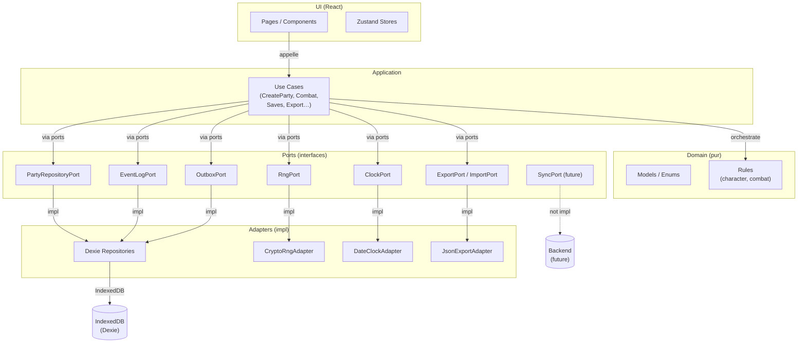
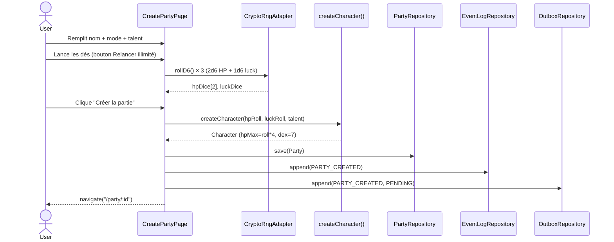
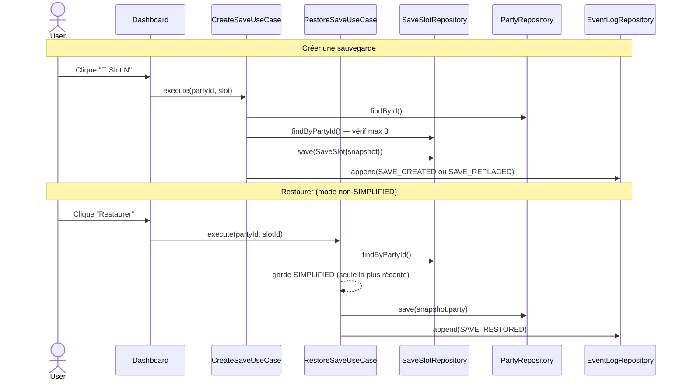
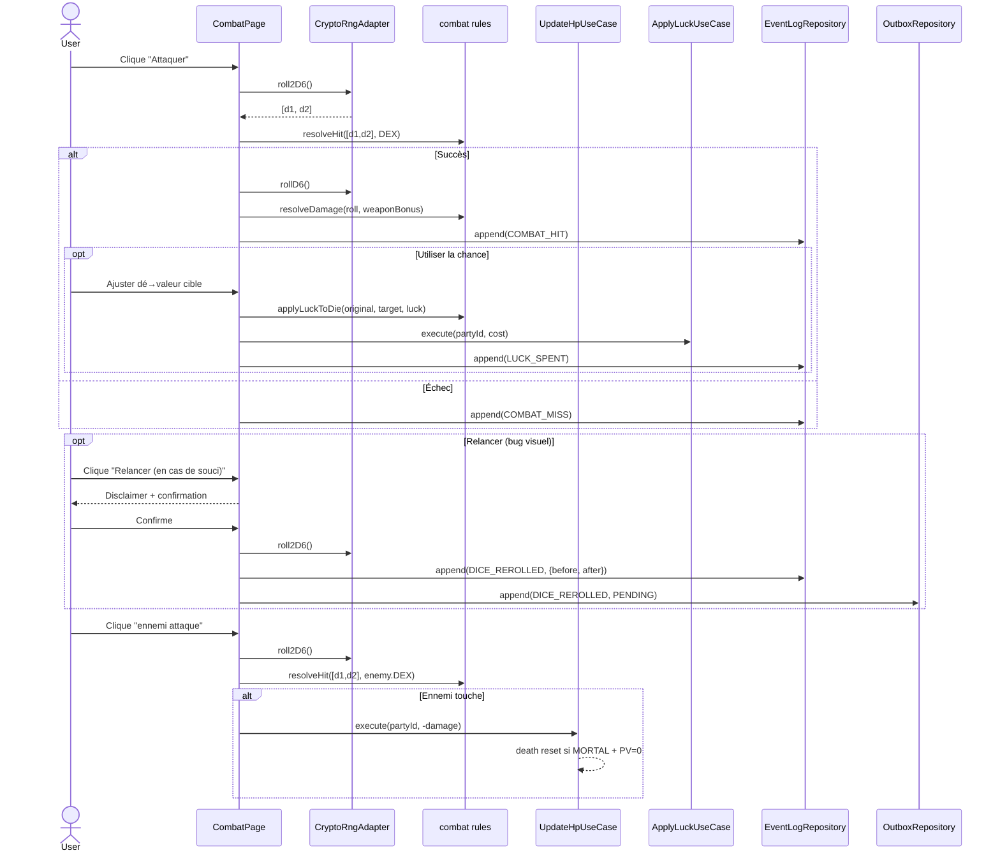

# Architecture – Dagda PWA

## 1. Architecture Hexagonale



## 2. Flux création de partie (Wizard)



## 3. Flux sauvegarde / restauration



## 4. Flux combat + chance + relance dés



## 5. Flux Outbox / Sync future

```mermaid
flowchart LR
    UC[Use Cases\n- CreateParty\n- UpdateHp (death)\n- CreateSave\n- FinishParty\n- DiceRerolled]
    -->|append PENDING| OB[(Outbox\nIndexedDB)]

    OB -->|findPending| SYNC[SyncPort\n⚠️ non implémenté]
    SYNC -->|pushEvents| API[(Backend API\nfuture)]
    SYNC -->|updateStatus SENT| OB

    style SYNC stroke-dasharray: 5 5
    style API stroke-dasharray: 5 5
```

### Modèle OutboxEvent

```typescript
interface OutboxEvent {
  id: string;           // UUID
  partyId: string;
  type: TimelineEventType;
  payload: Record<string, unknown>;
  status: "PENDING" | "SENT";
  createdAt: string;    // ISO
  sentAt?: string;      // ISO, rempli par SyncAdapter
}
```

### Implémenter la synchro backend (guide)

1. Créer `src/adapters/HttpSyncAdapter.ts` implémentant `SyncPort`
2. Enregistrer dans `src/application/container.ts`
3. Créer un worker/hook `useSyncWorker` qui :
   - Appelle `outboxRepo.findPending()`
   - Appelle `syncAdapter.pushEvents(events)`
   - Met à jour les statuts à `SENT`
4. Le backend reçoit les événements et reconstruit l'état (event sourcing)
